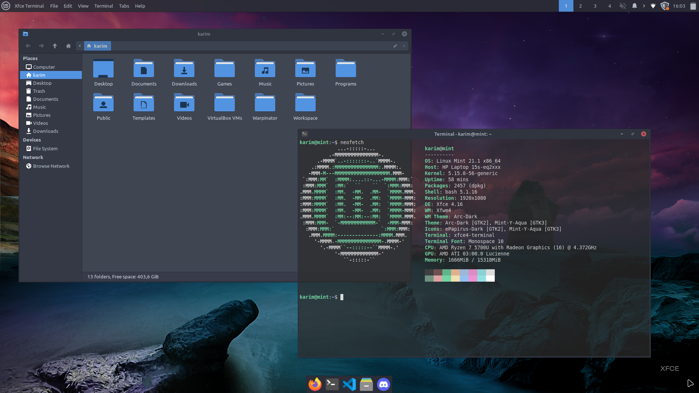

# mint.dotfiles

mint + xfce4



**Pre-requisites**
```
apt install wget curl
```

### Theme
**DE/WM**

```
$ apt install -y git arc-theme
```

```
$ xfconf-query -c xsettings -p /Net/ThemeName -s Arc-Dark
$ xfconf-query -c xfwm4 -p /general/theme -s Arc-Dark
```

```
$ xfconf-query -c xfwm4 -p /general/show_dock_shadow -s false
$ xfconf-query -c xfwm4 -p /general/show_frame_shadow -s false
```

**Icon**

```
$ sudo add-apt-repository -y ppa:papirus/papirus && apt update
$ apt install -y papirus-icon-theme
```

```
$ xfconf-query -c xsettings -p /Net/IconThemeName -s ePapirus-Dark
```

**Terminal**

```
$ curl https://raw.githubusercontent.com/mortim/mint.dotfiles/master/config/xfce4-terminal/terminalrc > ~/.config/xfce4/terminal/terminalrc
```
**Panel**

```
$ apt install xfce4-appmenu-plugin
```

```
$ xfconf-query -c xfce4-panel -p /panels/panel-1/enter-opacity -s 95
$ xfconf-query -c xfce4-panel -p /panels/panel-1/leave-opacity -s 95
```

**Desktop**

```
$ xfconf-query -c xfce4-desktop -p /desktop-icons/file-icons/show-home -s false
```

Wallpaper link [here](https://www.xfce-look.org/p/1483687)

```
$ mv 'XFCE 94 With Logo.png' ~/Pictures/wallpaper.png
$ xfconf-query -c xfce4-desktop -p /backdrop/screen0/monitor$(xrandr --listmonitors | grep "+" | cut -d " " -f 6)/workspace0/last-image -s ~/Pictures/wallpaper.png
```

**Font**
```
$ apt install -y fonts-firacode
```

---

### Packages
```
$ apt install -y neofetch git vim openjdk-11-jdk virtualbox steam feh g++ filezilla gparted
```

- [Discord](https://discord.com/) package
- [VSCode](https://code.visualstudio.com/) package
- [Haskell](https://www.haskell.org/ghcup/) package
- [Docker](https://docs.docker.com/engine/install/ubuntu/) package
- [Prince](https://www.princexml.com/download/)

**Package configuration**

**VS Code**

extensions:
```
$ curl https://raw.githubusercontent.com/mortim/mint.dotfiles/master/scripts/install_vscode_ext | sh
```

config:
```
$ curl https://raw.githubusercontent.com/mortim/mint.dotfiles/master/config/vscode/settings.json > ~/.config/Code/User/settings.json
```

**Python**
(check the **[Bash](#shell-configuration)** configuration to export ~/.local/bin directory)

```
$ curl https://bootstrap.pypa.io/get-pip.py | python3
```

**Virtualbox** (for school)

**Edit the virtualbox .desktop file to change the default theme:** ``VirtualBox -style cleanlooks``

Download Windows 10 VM [here](https://nextcloud.univ-lille.fr/index.php/s/JkGsRDss9Sk972d)

username: **user**,
password: **user**

With:
- Microsoft Office ([link](https://github.com/massgravel/Microsoft-Activation-Scripts))
- PowerAMC

```
$ wget https://nextcloud.univ-lille.fr/index.php/s/JkGsRDss9Sk972d/download/Windows%2010.ova
$ VBoxManage import 'Windows 10.ova'
$ rm 'Windows 10.ova'
```

---

### VPN (for school)
```
$ wget https://infotuto.univ-lille.fr/fileadmin/user_upload/infotuto/images/DSI/Fichiers_telechargeables/Clients_VPN/ULILLE_VPN_ETUDIANT_Linux_v4_2.zip
$ unzip ULILLE_VPN_ETUDIANT_Linux_v4_2.zip -d vpn
$ nmcli connection import type openvpn file vpn/ULILLE_VPN_ETU_TCP_v4_Linux.ovpn
$ rm -r vpn ULILLE_VPN_ETUDIANT_Linux_v4_2.zip
```

**Internet access (proxy)**
```
$ cd ~
$ wget https://raw.githubusercontent.com/mortim/mint.dotfiles/master/scripts/activate_proxy
$ chmod u+x activate_proxy
$ mkdir -p Programs/scripts
$ mv activate_proxy Programs/scripts
```

(check [Shell Configuration](#shell-configuration) section to set the 'activate_proxy' script as alias)

---

### Keyboard shortcuts

Use the official GUI software from Xfce for keyboard settings

| Shortcut  | Description  | Command  |
|    ---    |     ---      |   ---    |
| Alt + T  | File explorer  | thunar  |
| Alt + F  | Web browser  | firefox  |
| Alt + D  | Instant messaging software | discord
| Shift + Print  | Screenshot region  | xfce4-screenshooter -r  |
| Alt + Escape  | Screenshot the active window  | xfce4-screenshooter -w  |
| Ctrl + Print  | Screenshot fullscreen  | xfce4-screenshooter -f  |

---

### Shell configuration
```
$ cd ~
```

**Workspace directory**

```
$ mkdir -p Workspace/{iut,lab,projects}
```

**Bash**

```
$ echo -e '\nexport PATH=~/.local/bin:$PATH' >> .bashrc
$ source .bashrc
```

**iJava**
(for school)

```
$ wget https://raw.githubusercontent.com/mortim/mint.dotfiles/master/lib/program.jar -P Workspace/iut/lib
$ curl https://raw.githubusercontent.com/mortim/mint.dotfiles/master/config/bash/.bash_aliases > .bash_aliases
$ source .bash_aliases
```

**Ghci**

```
$ wget https://raw.githubusercontent.com/mortim/mint.dotfiles/master/config/ghci/.ghci
$ chmod go-w .ghci
```
